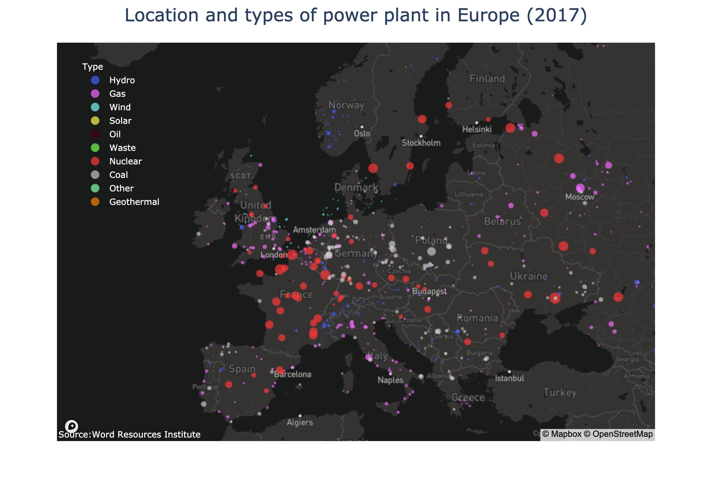

# Towards sustainable development

An environmentally sustainable power sector is central to modern society since plants have significant impact on climate, through carbon dioxide (CO2) emissions; on water stress, through water withdrawal and consumption; and on air quality, through sulfur oxides (SOx), nitrogen oxides (NOx), and particulate matter (PM) emissions. 

Under the **Paris Agreement** (since 2016) and the evidences on climate change, we engaged ourselves in reducing the level of CO2 emission. How much were we successful?

Here I performed analyses on the energy consumption/production in Europe; the datasets are publicly accessible in “our world in data” and “world resources institute” and contains the following characteristics and indicators:

-	All types of fuel
-	Technical characteristics (fuel, technology, ownership)
-	Plants’ geolocation
-	Energy production/consumption (per capita) around the globe since 1965
-	Annual change in primary energy consumption

## Primary Energy Consumption by Source

Here I showed the share of primary energy consumption, including electricity, transport and heating, among **Nuclear, Fossil, and Renewable sources** country-by-country in Europe since 1965.

In the bar plot I illustrated also the global changes in energy consumption across Europe.

## The Compensation Strategy

In the previous section, since 1965 to 2019 we see a reduction of 14% in the consumption of energy from Fossil sources. **But how did we compensate this reduction?** 

To answer this question and quantified the percentage shift from high-carbon energy sources, I used a metric which is the negative rate (regression slope) of Fossil source multiplied by the different in rate of Renewables from Nuclear sources: 

-Fossil x [Renewables – Nuclear].

For example, if the rate of fossil consumption since 1965 is negative and high, and rate of renewables is high, and assuming the rate of nuclear is unchanged, the metric will have positive value; however, if the rate of renewables is unchanged but the rate of nuclear consumption is increase, the value will be negative. 

The maximum and minimum values provided by this metric is assigned to **Iceland** and **France**, respectively, showing their compensation strategy on reducing CO2 emission and energy consumption from fossil fuels. 

In the Treemap I showed the percentage shift from Fossil to renewables (in green) and from Fossil to Nuclear (in red), where the size of each country indicated their percentage shift since 1965 to 2019. 

## Geolocations of Power Plants in Europe

A simple illustration on the location of all the power plants and their types across Europe, by 2017.

## What sources do we get our energy from?

Let’s look at our energy mix today, and explore what sources we draw upon, and **“how much of global energy comes from renewable sources?”**

